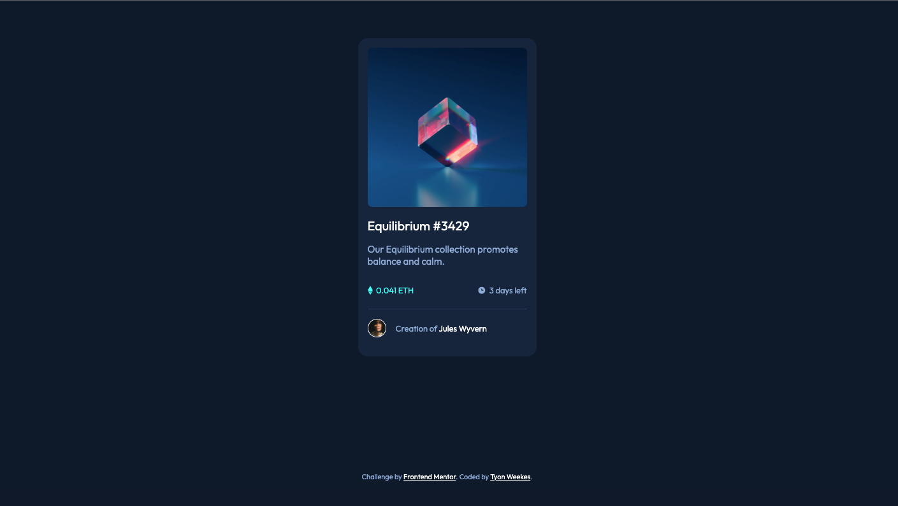

# Frontend Mentor - NFT preview card component solution

This is a solution to the [NFT preview card component challenge on Frontend Mentor](https://www.frontendmentor.io/challenges/nft-preview-card-component-SbdUL_w0U). Frontend Mentor challenges help you improve your coding skills by building realistic projects. 

## Table of contents

- [Overview](#overview)
  - [The challenge](#the-challenge)
  - [Screenshot](#screenshot)
  - [Links](#links)
- [My process](#my-process)
  - [Built with](#built-with)
  - [What I learned](#what-i-learned)
  - [Continued development](#continued-development)
  - [Useful resources](#useful-resources)
- [Author](#author)

**Note: Delete this note and update the table of contents based on what sections you keep.**

## Overview

### The challenge

Users should be able to:

- View the optimal layout depending on their device's screen size
- See hover states for interactive elements

### Screenshot

### Links

- Solution URL: [NFT Preview Card Component](https://beamish-mochi-1574cd.netlify.app)

## My process

### Built with

- CSS variables
- Flexbox
- CSS Grid

### What I learned

- How to create hover states
- How to create a semi-transparent overlay with an image on top
- How to position an image within a relatively-positioned element
- Practiced Flexbox some more here
- How to group items within divs for styling purposes
- How to style an hr element
- How to add a border to a circular image
- Reinforced how to overwrite styles (links in this case)

### Continued development

I would like to refine how to center items, as there may be a more efficient way. I'm still interested in practicing responsive code and JavaScript more. Wordpress is also something that I think would be helpful to know.

### Useful resources

- [Stack Overflow - Add Border to Circle Image](https://stackoverflow.com/questions/16310985/add-border-to-circle-image) - This helped me learn how to add a border to a circular image.

- [Rapid Tables - HSL to RGB Converter](https://www.rapidtables.com/convert/color/hsl-to-rgb.html) - This is a good website for HSL to RGB color conversion.

- [Wisdm Labs - Show Color Overlay Image Hover Using CSS](https://wisdmlabs.com/blog/show-color-overlay-image-hover-using-css/) - This taught me how to do cover overlays. Very helpful, would recommend.

## Author

- Website - [Tyon Weekes](https://www.tyonweekes.com)
